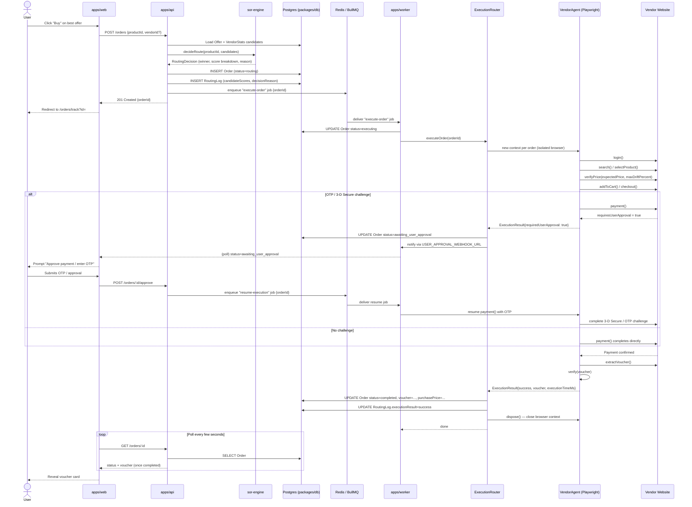

# Architecture — AI Voucher Smart Order Routing Platform

## 1. System Overview

No vendor in this marketplace exposes an API. Every price check, stock check, and purchase
happens by driving a real browser against a real vendor website. The platform exists to make that
process fast, scored, auditable, and safe to run unattended.

End-to-end pipeline:

```
User → Frontend (apps/web) → Backend API (apps/api) → SOR Engine (packages/sor-engine)
     → Execution Router (packages/vendor-agents) → Playwright Vendor Agents
     → Vendor Websites → Voucher Extraction → Database (packages/db) → User
```

1. A **user** searches for a product (e.g. a specific gift card / voucher) on the **frontend**.
2. The **backend API** (Fastify, port 4000) serves normalized `Offer` rows already collected by
   background crawlers — the user never waits on a live scrape.
3. When the user places an order, the API persists an `Order` and hands the candidate offers to
   the **SOR engine**, which scores every eligible vendor and picks a winner — recorded
   immutably as a `RoutingLog`.
4. An `execute-order` job is enqueued on Redis/BullMQ. **apps/worker** picks it up and hands off
   to the **Execution Router**, which launches an isolated Playwright `BrowserContext` for that
   one order.
5. The matching **vendor agent** logs in, searches, verifies the live price, checks out, pays,
   and extracts the voucher from the vendor's confirmation page/email.
6. The extracted voucher is validated, written back to the `Order` row, and the frontend (which
   polls order status) reveals it to the user.

The system deliberately never picks a vendor "purely on price" — see §3.

## 2. Module Responsibilities

### Packages

| Package | Responsibility |
|---|---|
| `packages/shared-types` | Single source of truth for every domain type (`Product`, `Vendor`, `Offer`, `Order`, scoring types, `VendorAgent` contract). Both `apps/*` and the other packages import from here — no type is redefined downstream. |
| `packages/sor-engine` | Pure, dependency-free scoring library. Takes normalized offer + vendor-stat data in, returns a ranked list and a routing decision out. No I/O, no DB, no network — fully unit-testable (see `packages/sor-engine/test/`). |
| `packages/vendor-agents` | Playwright automation framework: the `VendorAgent` interface implementations (one per vendor site), the `ExecutionRouter` that launches/tears down browser contexts per order, and the crawlers that populate raw offer data. |
| `packages/db` | Prisma schema + generated client. The only package that talks to Postgres directly; `apps/api` and `apps/worker` both depend on it rather than owning their own schema copies. |
| `packages/logger` | Shared `pino` logger (`@voucher-sor/logger`) plus `logEvent()`, a thin helper that both logs structuredly and is the expected call site for persisting to the `EventLog` table (see §6). |

### Apps

| App | Responsibility |
|---|---|
| `apps/api` | Fastify HTTP API, port 4000. Routes: `GET /products`, `GET /products/:id/offers`, `POST /orders`, `GET /orders/:id`, `GET /vendors`. Runs `decideRoute()` from `sor-engine` synchronously on order placement, writes the `RoutingLog`, then enqueues the execution job — it does not launch browsers itself. |
| `apps/worker` | BullMQ consumer process, three queues: `crawl` (runs vendor crawlers on `CRAWL_INTERVAL_MINUTES`), `scoring` (recomputes `Offer.finalScore` on `SCORING_RECALC_INTERVAL_MINUTES`), `execution` (runs one Playwright checkout per job via the Execution Router). No inbound HTTP. |
| `apps/web` | Next.js (App Router), `output: "export"` — a fully static bundle (no Node server, no SSR), served by nginx or any static host/CDN. Pages: `/` (search/home), `/products?id=` (vendor comparison), `/orders` (history), `/orders/track?id=` (live tracking) — query params instead of dynamic file-based segments, since static export can't pre-render order/product IDs that don't exist until runtime. Every page fetches client-side from `NEXT_PUBLIC_API_BASE_URL` (baked in at build time); the app never touches Postgres/Redis directly. |

## 3. Smart Order Routing — Scoring Formula

Source of truth: `packages/sor-engine/src/scores.ts`, `engine.ts`, and `config.ts`.

**Final Score** for a candidate offer:

```
FinalScore =  PriceScore        * W_price
            + SuccessScore      * W_successRate
            + SpeedScore        * W_checkoutSpeed
            + StockConfidence   * W_stockConfidence
            + ReliabilityScore  * W_reliability
            - RiskPenalty       * W_risk
```

Default weights (`DEFAULT_SCORING_WEIGHTS`, sum of the five positive weights = 1.0; risk is a
penalty applied on top, not part of that sum):

| Weight | Value |
|---|---|
| `price` | 0.35 |
| `successRate` | 0.20 |
| `checkoutSpeed` | 0.15 |
| `stockConfidence` | 0.10 |
| `reliability` | 0.10 |
| `risk` | 0.10 |

Price alone is capped at 35% of the score — a cheaper-but-flaky vendor cannot automatically win.

### Component formulas

- **PriceScore** = `LowestPrice / VendorPrice`, clamped to `[0, 1]`. The cheapest eligible vendor
  always scores exactly `1.0`; `lowestPrice` is the minimum price across *all eligible* candidates
  for the product, computed by the caller (`rankOffers`), never the candidate's own price.
- **SuccessScore** = `successfulOrders / totalOrders` over the rolling window (last 500 orders,
  `ROLLING_WINDOW_SIZE`). Vendors with zero orders score `0`, not `NaN`.
- **SpeedScore** = `1 - (averageCheckoutTimeMs / maxExpectedCheckoutTimeMs)`, clamped to `[0, 1]`.
  Default ceiling `DEFAULT_MAX_EXPECTED_CHECKOUT_TIME_MS = 30,000ms`; vendors slower than that
  floor to a `0` speed score.
- **ReliabilityScore** = `successfulExecutions / totalExecutions` — the *browser automation's*
  success rate (did the script complete without crashing/erroring), independent of whether the
  resulting order itself was fulfilled.
- **StockConfidence** — fixed lookup by `StockStatus`, not a formula:

  | StockStatus | Value |
  |---|---|
  | `confirmed` | 1.00 |
  | `recently_scraped` | 0.80 |
  | `unknown` | 0.50 |
  | `previously_failed` | 0.20 |
  | `out_of_stock` | 0.00 |

- **RiskPenalty** — fixed lookup by the worst friction signal (`CaptchaLevel`) seen on the
  vendor's last checkout, not a formula:

  | CaptchaLevel | Value |
  |---|---|
  | `none` | 0.00 |
  | `light` | 0.20 |
  | `heavy` | 0.50 |
  | `otp` | 0.80 |
  | `checkout_failure` | 1.00 |

### Routing decision

`decideRoute(productId, candidates)`:
1. Filters out ineligible candidates (`eligible === false` or `stockStatus === "out_of_stock"`) —
   they are dropped, not scored.
2. Scores and sorts the remainder highest-score-first (`rankOffers`).
3. Selects the top-scoring vendor as `selectedVendorId`, and writes a human-readable
   `decisionReason` string (full score breakdown + margin over the runner-up) that becomes the
   audit trail in `RoutingLog.decisionReason`. If no candidates are eligible, `selectedVendorId`
   is `null` and the reason explains why.

## 4. Purchase Flow — Sequence Diagram



## 5. Component / Module Diagram

```mermaid
graph TD
    User((User))
    Web["apps/web<br/>Next.js :3000"]
    API["apps/api<br/>Fastify :4000"]
    SOR["packages/sor-engine<br/>scoreOffer / rankOffers / decideRoute"]
    Queue[("Redis<br/>BullMQ: crawl / scoring / execution")]
    Worker["apps/worker<br/>BullMQ consumers"]
    Router["ExecutionRouter<br/>(packages/vendor-agents)"]
    Agents["VendorAgent implementations<br/>(Playwright, one per vendor)"]
    Vendors[("Vendor Websites<br/>(no APIs)")]
    DB[("Postgres<br/>packages/db (Prisma)")]
    Types["packages/shared-types<br/>(types consumed by all)"]
    Logger["packages/logger<br/>pino + logEvent()"]

    User -->|search / buy| Web
    Web -->|HTTP| API
    API -->|reads candidates| DB
    API -->|decideRoute| SOR
    API -->|writes RoutingLog, Order| DB
    API -->|enqueue execute-order| Queue
    Queue --> Worker
    Worker -->|crawl jobs| Agents
    Worker -->|scoring jobs| SOR
    Worker -->|execution jobs| Router
    Router -->|isolated BrowserContext| Agents
    Agents -->|Playwright automation| Vendors
    Agents -->|normalized offers / voucher| DB
    Worker -->|status updates| DB
    Web -->|poll order status| API

    Types -. types .- API
    Types -. types .- Worker
    Types -. types .- SOR
    Types -. types .- Agents
    Types -. types .- Web

    API -. logs .- Logger
    Worker -. logs .- Logger
    Agents -. logs .- Logger
    Logger -. persists .- DB
```



## 6. Frontend Wireframes

### Search / Home (`/`)

```
┌──────────────────────────────────────────────────────────┐
│  Voucher SOR                                    [Orders]  │
├──────────────────────────────────────────────────────────┤
│  [ Search vouchers by brand, e.g. "Amazon" ______ ] [Go]  │
│  Filters: [Country ▾] [Category ▾]                        │
├──────────────────────────────────────────────────────────┤
│  ┌────────────┐  ┌────────────┐  ┌────────────┐           │
│  │  Amazon    │  │  Steam     │  │  Google Pl │  ...      │
│  │  Gift Card │  │  Wallet    │  │  Store     │           │
│  │  from $9.50│  │  from $4.75│  │  from $9.90│           │
│  │  3 vendors │  │  5 vendors │  │  2 vendors │           │
│  └────────────┘  └────────────┘  └────────────┘           │
└──────────────────────────────────────────────────────────┘
```

### Product Detail + Vendor Comparison (`/products?id=`)

```
┌──────────────────────────────────────────────────────────┐
│  ← Back            Amazon Gift Card — $25 (US)            │
├──────────────────────────────────────────────────────────┤
│  Score breakdown (SOR ranking, best first)                │
│  ┌────────┬───────┬───────┬───────┬───────┬──────┬──────┐ │
│  │ Vendor │ Price │Success│ Speed │ Stock │ Risk │Final │ │
│  ├────────┼───────┼───────┼───────┼───────┼──────┼──────┤ │
│  │ VendA★ │ $23.99│ 0.94  │ 0.88  │ 1.00  │ 0.00 │ 0.91 │ │
│  │ VendB  │ $22.50│ 0.80  │ 0.70  │ 0.80  │ 0.20 │ 0.83 │ │
│  │ VendC  │ $23.75│ 0.60  │ 0.90  │ 0.50  │ 0.50 │ 0.66 │ │
│  └────────┴───────┴───────┴───────┴───────┴──────┴──────┘ │
│  ★ = SOR-selected vendor (not necessarily cheapest)        │
│                                                             │
│  Selected: VendA — "beat runner-up by 0.080, higher       │
│  success rate and stock confidence offset $1.49 premium"   │
│                                                             │
│                       [   Buy for $23.99   ]                │
└──────────────────────────────────────────────────────────┘
```

### Order Tracking (`/orders/track?id=`)

```
┌──────────────────────────────────────────────────────────┐
│  Order #ord_8f2a…            Status: EXECUTING             │
├──────────────────────────────────────────────────────────┤
│  Status Stepper                                            │
│  [✓Routed]─[✓Browser Launched]─[●Checking Out]─[ Paying ] │
│                                          ─[ Extracting ]   │
│                                          ─[ Completed ]    │
│                                                             │
│  Live log:                                                 │
│    12:03:01  routing_decided — VendA selected               │
│    12:03:02  browser_launched                               │
│    12:03:05  searching → verifying_price                    │
│    12:03:09  adding_to_cart → checking_out                  │
│                                                             │
│  (if awaiting_user_approval)                                │
│  ┌────────────────────────────────────────────────────┐   │
│  │  Action required: enter the OTP sent to your bank    │   │
│  │  [ ______ ]                         [ Approve ]      │   │
│  └────────────────────────────────────────────────────┘   │
└──────────────────────────────────────────────────────────┘
```

### Order History (`/orders`)

```
┌──────────────────────────────────────────────────────────┐
│  My Orders                                                 │
├──────────────────────────────────────────────────────────┤
│  ┌──────────────────────────────────────────────────────┐ │
│  │ Amazon Gift Card $25   VendA   $23.99   COMPLETED  →  │ │
│  │ Steam Wallet $10       VendB   $9.20    FAILED     →  │ │
│  │ Google Play $50        VendC   —        EXECUTING  →  │ │
│  └──────────────────────────────────────────────────────┘ │
│                                                             │
│  (row expands to reveal voucher)                            │
│  ┌──────────────────────────────────────────────────────┐ │
│  │  Voucher — Amazon Gift Card $25                        │ │
│  │  Code:  XXXX-XXXX-XXXX-XXXX          [Copy]            │ │
│  │  PIN:   ----                                           │ │
│  │  Expires: 2027-01-01                                    │ │
│  └──────────────────────────────────────────────────────┘ │
└──────────────────────────────────────────────────────────┘
```

## 7. TypeScript Interface Reference

All domain types live in `packages/shared-types/src/` and are re-exported from `index.ts`. Treat
these files as the source of truth rather than any duplication below:

| File | Purpose |
|---|---|
| `product.ts` | `Product` — the catalog entity vendors sell offers against. |
| `vendor.ts` | `Vendor`, `VendorStats`, `CaptchaLevel` — vendor identity and rolling operational stats that feed scoring. |
| `offer.ts` | `Offer` (normalized, scored) and `RawVendorOffer` (pre-normalization crawler output). |
| `order.ts` | `OrderStatus`, `VoucherPayload`, `Order`, `OrderExecutionEvent` — the purchase lifecycle and live-status stream. |
| `scoring.ts` | `ScoringWeights`, `DEFAULT_SCORING_WEIGHTS`, `ScoreBreakdown`, `RoutingDecision` — the SOR contract (see §3). |
| `routing-log.ts` | `RoutingLog` — the audit-trail shape persisted per order. |
| `vendor-agent.ts` | `VendorAgent` interface, `ExecutionRequest`/`ExecutionResult`, `VendorAgentStage`, `PriceMismatchError`, `VendorAgentStepError` — the contract every Playwright vendor implementation must satisfy. |

## 8. Logging & Observability

Two layers, both populated from the same call sites:

- **`@voucher-sor/logger`** (`packages/logger`) — a shared `pino` logger. Each app calls
  `.child({ app: "..." })` once at startup; `logEvent(type, fields)` emits a structured log line
  *and* is the expected call site for persisting the same event to the database (below), so
  history isn't lost when log retention rotates.
- **`EventLog` table** (`packages/db/prisma/schema.prisma`) — durable, queryable event history.
  `EventType` enum: `crawl`, `checkout_duration`, `browser_crash`, `captcha`, `payment_failure`,
  `voucher_extraction_failure`, `routing_decision`. Each row optionally links to a `vendorId`
  and/or `orderId` plus a free-form `metadata` JSON blob.

Tracked signals:

| Signal | Recorded as |
|---|---|
| Crawl duration / outcome | `EventLog.type = crawl` |
| Checkout duration | `EventLog.type = checkout_duration`; also rolled into `VendorStats.averageCheckoutTimeMs` |
| Browser crashes (Chromium OOM/target-closed) | `EventLog.type = browser_crash` |
| CAPTCHA sightings (level reached) | `EventLog.type = captcha`; also rolled into `VendorStats.lastCaptchaLevel` |
| Payment failures | `EventLog.type = payment_failure` |
| Voucher extraction failures | `EventLog.type = voucher_extraction_failure` |
| Vendor success rate | Derived from `VendorStats.successfulOrders / totalOrders`, not logged per-event |
| Routing decisions | `EventLog.type = routing_decision` **and** the full breakdown in `RoutingLog` (richer, one row per order) |

`RoutingLog` and `EventLog` intentionally overlap on routing decisions: `RoutingLog` is the
per-order audit trail (candidate scores, decision reason, execution result); `EventLog` is the
cross-cutting operational stream a dashboard tails to answer "is anything on fire right now."

## 9. Scalability

- **Horizontal worker scaling** — `apps/worker`'s execution queue concurrency (BullMQ's
  `concurrency` option) controls how many Playwright browser contexts run per pod; the
  `worker-hpa.yaml` HorizontalPodAutoscaler controls how many pods exist. Total throughput is
  `replicas x concurrency`; scale the former via k8s, the latter via config (see
  `infra/k8s/worker-deployment.yaml` for the full rationale and memory-sizing notes).
- **Retry / failure recovery** — BullMQ jobs use `attempts` + exponential `backoff` so a flaky
  vendor site (timeout, transient CAPTCHA) gets retried automatically rather than failing the
  order outright; `ExecutionResult.failureStage` records exactly which `VendorAgentStage` failed
  so retries and alerts can be targeted.
- **Unlimited vendors and products** — the normalized `Offer` table (`vendorId` x `productId`
  unique) means adding a new vendor or product is a data problem, not a schema change: write a new
  `VendorAgent` + crawler, backfill `Offer` rows, and the SOR engine and API need no changes.
- **Multi-country** — `Product.country` is a plain indexed column (`@@index([brand, country])`);
  the same product name in different markets is a different `Product` row with its own offers,
  so regional rollout is additive, not a re-architecture.
